# EagleNet: 一个高性能的TCP服务器框架

## 设计目标

**高并发**：

- 利用 Go 语言的并发模型，使用 goroutine 处理并发连接

- 基于 net/tcp，底层是异步IO模型epoll，可以高效处理大量并发

- 使用协程池处理业务，避免高并发场景下 goroutine 频繁调度带来的性能损耗

  

**高性能**：

- 尽量减少锁的使用，使用 channel 处理协程之间的同步
- 使用高效的 I/O 操作，如零拷贝技术
- 使用 sync.Pool 复用连接对象，减少内存分配带来的开销
- 调整网络参数，如 TCP 的 keep-alive 和 backlog 参数，以优化性能

**易拓展**：

- 模块化设计，功能模块清晰独立
- 面向接口编程，便于替换和扩展
- 支持插件

## 设计

**设计图：**

**设计说明：**

1. 一个TCP连接到来后，将它封装成一个Connection对象
2. 一个Connection会启动两个Goroutine：Reader和Writer
3. Reader负责从连接中读取数据，解析数据并封装成Request，发送给连接池某个Worker的缓冲队列
4. Worker从缓冲队列中获取Request，找到对应的Handlers执行
5. 在Handlers中向客户端写数据时，数据会被封装为Response，交给对应的Writer，由Writer负责将数据发送给客户端

**特性：**

- 处理业务的Handlers不用关心数据的封装、读写，实现了业务和通用逻辑的解耦
- 借助net/tcp底层的epoll模型，让Reader/Writer没有数据可以读/写时进入休眠状态，不占用CPU资源
- 使用固定数量的goroutine去处理请求的业务逻辑，而不是给每个连接开一个goroutine，因为处理业务逻辑需要占用大量CPU资源，不加以限制的话会造成不必要的切换成本，甚至耗尽系统的CPU资源
